********
Tutorial 
********
El objetivo principal del este tutorial es familiarizar al usuario con el proceso de ingeniería detrás del uso de un sistema SCADA.

En este tutorial se muestran ejemplos base, para el uso correcto del sistema SCADA.

Iniciando el sistema
====================
.. hint::
  Si se tiene alguna consulta adicional con respecto a la instalación o a las licencias, contacte con el siguiente correo:
  soporte@vestersl.com

1. Dar click derecho en el icono de atvise en la esquina inferior derecha del escritorio en la barra de tareas.
2. Se le da click al botón de ``License`` en el menú que se despliega.
3. Se introduce el código de licencia que se encuentra en el correo que manda atvise para la licencia de prueba.

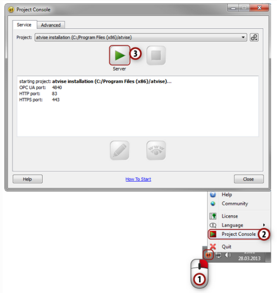

.. attention:: 
  El icono de atvise se pone verde, lo que significa que el servidor se encuentra arriba y listo para ser utilizado.
  Si es de otra manera no es posible conectarse al servidor.

.. hint:: 
  El protocolo de red que utiliza el servidor de atvise es OPC UA por el puerto 4840.
  Por lo anterior, es importante revisar que ninguna otra aplicación utilice este puerto de red. 

.. tip:: 
  Es posible apagar el servidor atvise escogiendo la opción ``Stop Server`` del mismo menú mencionado anteriormente.

Conectando con el constructor de atvise
=======================================

El constructor de atvise es la herramienta de ingeniería que se utiliza para desarrollar proyectos en SCADA. 
El mismo permite, manejar variables, objetos, grupos y usuarios, así como mostrar en pantalla las figuras configuradas, entre otras cosas.

Iniciando el constructor
------------------------
1. Se le da click derecho al icono de atvise en el taskbar, además se abre ``Project Console`` y dentro se le da click a la opción ``Builder`` para abrir el constructor de atvise.

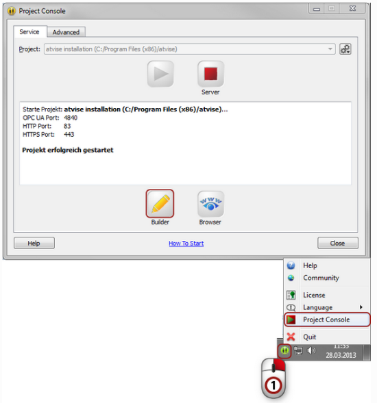

Conectando con el servidor
--------------------------

Después de haber iniciado el constructor siguiendo los pasos anteriores, se abre una ventana la cual pregunta por el servidor al que se quiere conectar, el usuario y la contraseña.
Lo anterior es el sistema que tiene atvise para conectar al modulo OPC UA en la máquina cliente.
La dirección IP por default que usa el servidor es el LocalHost.

.. hint::
  ``root`` es el usuario por defecto del sistema en cada nuevo proyecto. 
  Si se desea agregar una contraseña u otro usuario, se utiliza la herramienta de ``User Management``.

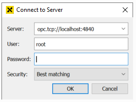

1. Seleccione ``builder -> Connect to server`` de la barra de tareas.
2. Una vez que se abre la ventana de conexión, se agregan los datos pertinentes al usuario y la dirección al servidor que se desea conectar. 

.. hint:: 
  Es posible ingresar la dirección IP de algún otro servidor o de algún equipo en la red local.

3. Hecho lo anterior, se presiona ``OK`` en la caja de dialo y se procede a conectar. 

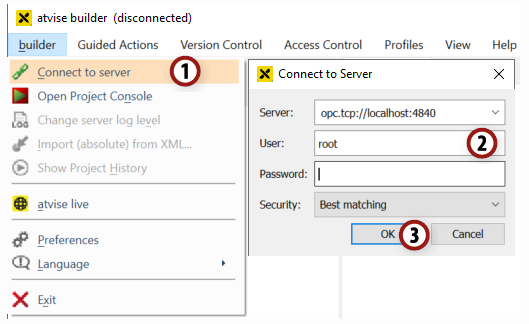

Creando la primer pantalla en atvise
====================================

Ahora que ya se cubrieron las bases de cómo conectarse al atvise. Esta sección busca dar la introduccion a cómo interactuar con el constructor de atvise.
De manera que en esta parte se va a añadir una pantalla base.

Añadiendo un display al proyecto
--------------------------------

1. Abra la ruta ``Servers -> My Server -> Display`` y de clicl derecho en el folder llamado ``MAIN``.
2. Escoja la opción ``Add Display`` de la lista desplegada.
3. Escriba un nombre apropiado para el display en cuestión.
4. Hechos los pasos anteriores se le da click a ``OK``.

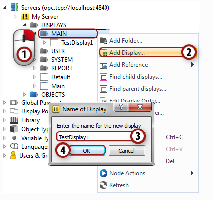

Editando el display y añadiendo eventos
---------------------------------------

1. Dar doble click en el display se que acaba de crear, para abrir el editor gráfico del display.
2. Busque el signo del rectángulo y selecciónelo.  
3. En el canvas blanco, haga un rectángulo.
4. Por último es necesario darle click al signo del CD para guardar la modificación.

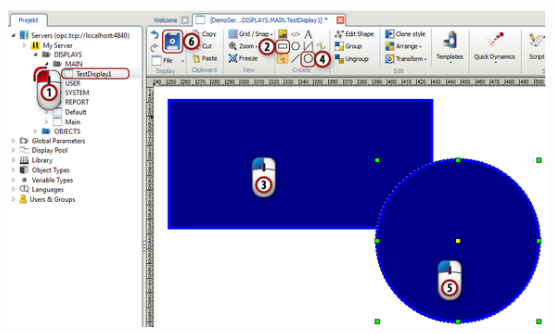

.. hint:: 
  Es posible usar la rueda del mouse para hacer zoom.

Visualizando el display en la web
---------------------------------

1. Ahora para observar el display que se ha creado en el tutorial, se abre el browser de internet de preferencia. 
2. Ponga en la barra de búsqueda el URL asignado al ``LocalHost``, normalmente es el siguiente : "https://127.0.0.1/"
3. Abra el display dando click al nombre que se asignó en la barra gris de la derecha. 

.. attention:: 
  Si se hacen cambios al display una vez que se abrió en el browser, utilice la tecla ``F5`` para recargar la página. 

Creando displays dinámicos
==========================

Primeras dinámicas
------------------

En esta sección se van a cambiar algunas de las propiedades gráficas de diferentes elementos dependiendo del valor que tengan cieras variables de datos.

Añadiendo variables de datos al proyecto
^^^^^^^^^^^^^^^^^^^^^^^^^^^^^^^^^^^^^^^^

Para añadir variables de datos al proyecto, dele click en la pestaña de ``Objects`` en la barra izquierda de la interfaz del constructor.

Se van a añadir 3 variables para este ejemplo:

* "testString" del tipo "String"
* "testBool" del tipo "Boolean"
* "testInt" del tipo "Int16"

1. Dar click derecho en la siguiente ruta ``Servers -> My Server -> Objects`` y abrir el folder.
2. Escoja ``Add Node -> Data Variable`` del menú que aparece.
3. Escoja ``String`` de la lista de tipos de variables.
4. Escriba el nombre de la variable, es este caso "testString" y seleccione la casilla `OK`.
5. Repita para las otras dos variables de la misma forma, pero seleccionando los tipos respectivos. 

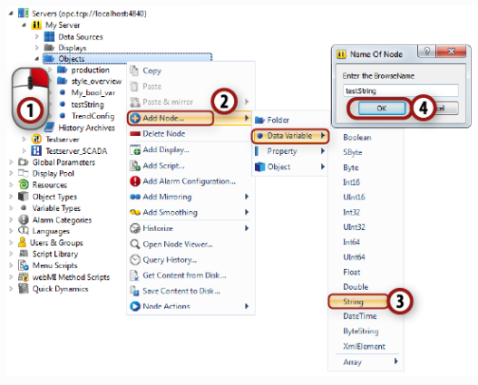

Leyendo y cambiando los valores de las variables de datos
"""""""""""""""""""""""""""""""""""""""""""""""""""""""""

Hecho todo lo anterior, usted verá una lista de variables para cada una de ellas que se agregó en la sección anterior.
Si por alguna razón fuera necesario cambiar el valor de alguna de las variables se deben seguir los siguientes pasos:

1. Dar doble click en la entrada de la variable llamada ``testString`` para que se abra una ventana de detalle para esa variable.
2. Ahora se le da doble click en la columna de ``AttributeValue`` en la file de ``Value`` para editar el valor de la variable en cuestión.

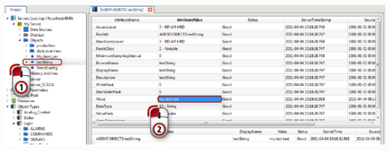

Usando los controles predeterminados de atvise
==============================================

Control de Barras
-----------------

1. Haga un display nuevo siguiendo las instrucciones anteriores.
2. En la parte baja del editor gráfico hay una barra con varios controles, agarre y suelte uno en el canvas de dibujo. 
3. Al hacer lo anterior, aparece una lista de parámetros del lado derecho. Seleccione la variable "testInt".
4. Puede cambiar otros parámetros si lo desea.  

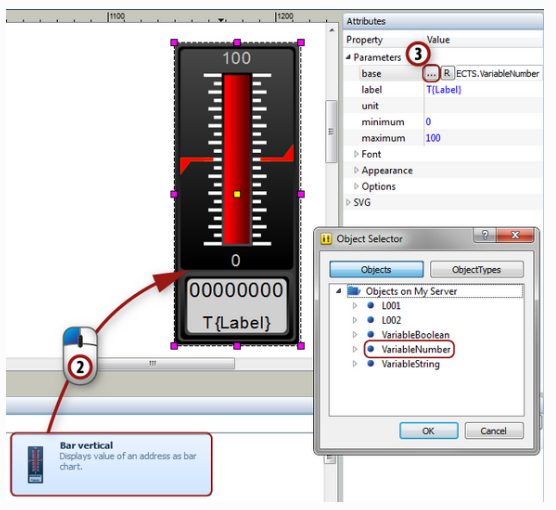

Control Incremental
-------------------

1. Ahora agarre y suelte un ``Button Increment/Decrement`` al canvas de dibujo.
2. Seleccione la variable "testInt". 
3. Seleccione "10" como el valor de salto. Hecho esto la variable incrementará su valor en 10 cada vez que se presione el botón.

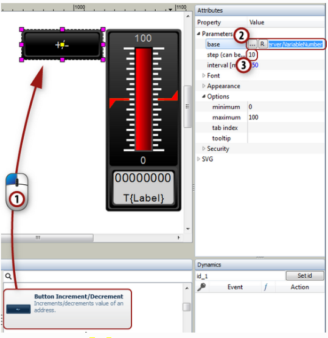

Conectando a un servidor externo
================================

Esta sección muestra como añadir un servidor externo al sistema.

Inicializando un servidor OPC UA de prueba
------------------------------------------
Primero que nada es importante iniciar el servidor de prueba y para esto es importante importar una estructura de datos.

Dentro de la jerarquía de archivos generada al instalar el programa, dentro de la carpeta ``atvise -> Tools -> OPC UA testserver`` y corra ese ejecutable.

Añadiendo un servidor externo
-----------------------------

1. Abra la carpeta ``Servers -> My Server -> Data Sources`` y de click derecho en ``Data Sources``.
2. Escoja ``Add Data Source`` and then ``OpcUa`` para abrir el menú de configuración de la fuente de datos. 
3. El servidor de prueba corre en el puerto 4841, entonces para acceder al mismo se utiliza la siguiente ruta: ``opc.tcp://localhost:4841`` 

Navegando en el servidor externo
--------------------------------

1. De click en la nueva instancia de servidor, en la lista de servidores.
2. Escoja la opción ``Browse``.

.. hint:: 
  Navegar por un servidor externo es sumamente útil para copiar rutas, identificadores de diferentes nodos y copiar variables de datos. 

Ingeniería  orientada a objetos
===============================
Con el fin de introducir el concepto de ingeniería orientada a objetos, se desarrolla un ejemplo el cual tiene como objetivo diseñar un ``Type`` encargado de mostrar y controlar el estado de una luz eléctrica en un edificio. 

Para este experimento se manejan las siguientes variables: 

* Intensidad Luminosa.
* Alarma de protección.

.. hint::
  Navegando por el servidor de prueba se pueden hallar estas variables.
  Si quiere puede copiarlas.

Agregando un nuevo tipo de objeto
---------------------------------
1. Dar click derecho en el botón de ``Object Types`` en el árbol de archivos.
2. Seleccione ``Add Note -> Object Type``.
3. En el menú que aparece, se puede escribir el nombre del nuevo tipo de variable, en este caso se usa ``Light``.
4. Después de darle ``OK``, aparece el nuevo tipo ``Light`` en la lista de tipos.

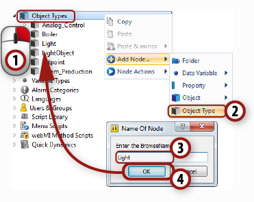

Agregando una estructura de datos
---------------------------------

1. Dar click derecho al tipo creado anteriormente ``Light``.
2. Escoja ``Add Node -> Folder`` del menú que aparece.
3. Escoja un nombre representativo para el folder en cuestión como ``ALARMS`` y agreguelo al tipo ``Light``.
4. Repita el paso anterior pero ahora cree otro folder con el nombre ``COMMANDS``.
5. Nuevamente reporta el paso 3 pero haga otro folder con el nombre ``SIGNALS``. 

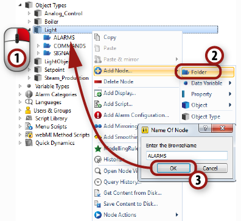

Creando instancias de objetos
-----------------------------
En esta sección se crean instancias del tipo de objeto creado anteriormente.

1. Dar click derecho en ``Servers -> My Server -> Objects`` y escoja ``Add Node -> Object``. en el submenú que aparece, usted verá que aparece el tipo ``Light``, dele click para crear una instancia de este tipo.
2. El objetivo es crear cinco instancias numeradas, por esto se le da click a la opción de ``numbered``.
3. Con el fin de usar nombres claros, se remplaza el nombre por defecto por ``OfficeLight_%1`` , el ``%1`` es un comodín, el cual será remplazado por ``001-005`` por cada una de las instancias.
4. El object count se pone en 5, ya que se quieren cinco instancias.  

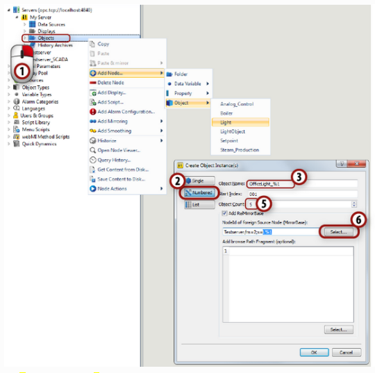

Agregando un display a un objeto
================================
En esta sección se ve cómo agregar un display a un objeto.

Agregando un display a un tipo
------------------------------

1. Dar click derecho al tipo ``Light`` creado en la sección anterior y seleccione ``Add display``.
2. Escriba un nombre como ``Main Display`` y agreguelo al objeto y dele ``OK``.

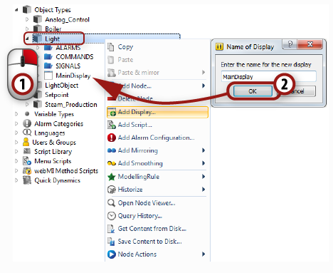

.. hint::
  Si se le da click al nuevo display y se abre el menú de ``ModellingRule``, usted verá que aparece un check en un anuncio que se llama ``Shared``. Esto significa que el display del tipo asociado está referenciado a cada uno de las instancias de los objetos creados con anterioridad. El display se ve y se comporta de igual manera para cada uno de los objetos, por lo que no hace falta crear un display para cada instancia.

Diseñando un display para el objeto
-----------------------------------

Creando un fondo para el display
^^^^^^^^^^^^^^^^^^^^^^^^^^^^^^^^

1. De doble click al ``Main Display`` para abrir el editor gráfico.
2. Ahora dibuje un fondo para el objeto en cuestión. Primero haga un rectángulo del tamaño que quiera.
3. Para el fondo se quiere un relleno en forma de gradiente, entonces marque el rectángulo y haga click en la opción de ``fill`` debajo del dibujo.
4. Es posible cambiar el color del gradiente, haciendo doble click en los pequeños triángulos debajo de la barra del gradiente. 
5. Cambie el ángulo del gradiente, para esto mueva los circulos rojos. 
6. Cuango haya terminado el diseño haga click en ``File -> settings``.
7. Haga click en el botón de ``Fit`` para ajustar el fondo.

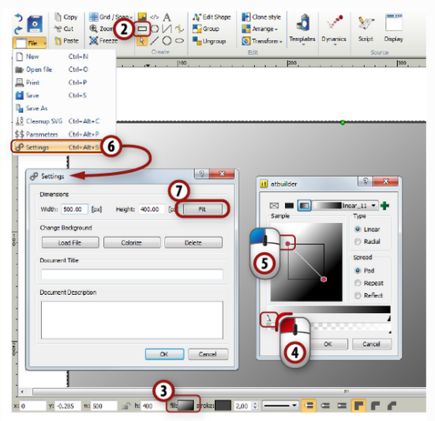

Añadiendo historia al proyecto
==============================

Configurando la historia de las variables de datos
--------------------------------------------------

1. Abra la lista de objetos creados haciendo click en ``Object Types`` en la barra del lado izquiero del constructor de atvise.
2. Abra la estructura de archivosde del objeto ``Light`` creado con anterioridad y de click derecho en ``COMMANDS -> Light Intensity``.
3. Escoja la opción de ``Historize`` del menú que se le desplegó del punto anterior y seleccione la opción de ``datavalues`` bajo lo que dice ``Raw Archive``.
4. Repita lo mismo para la variable ``SIGNALS -> LightIntensity``.

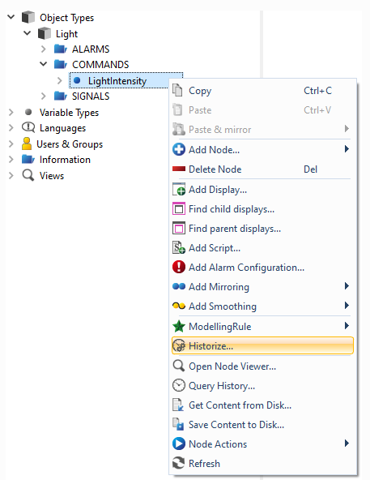

Mostrando la historia en la ventana de visualización
----------------------------------------------------

1. Abra el display de ``Office_Light`` que se creó con anterioridad.
2. Cambie el parámetro de ``LightIntensity`` para varios cuartos.
3. Ahora haga click en el símbolo de historia en el panel de control para ver como cambian los valores. 

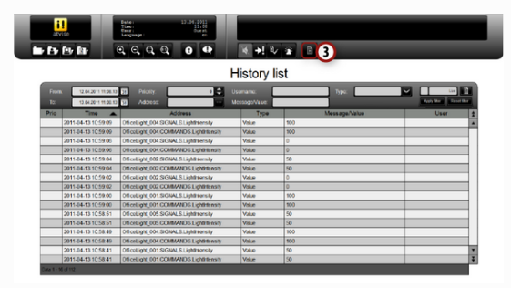

Agregando alarmas al proyecto
=============================

configuración de una alarma
---------------------------
1. Abra la lista de objetos dando click a la opción de "Object Types" del lado izquierdo de la interfaz del constructor de atvise.
2. De click derecho en la variable de datos ``Light -> ALARMS -> InternalMalfunction``.
3. Escoja ``Add AlarmConfiguration`` del menú que se le despliega.
4. Escriba el nombre que le quiera dar a la configuración alarma.
5. Observe como aparece en la lista de opciones ``LightMalfunction`` debajo de la variable.
6. Como primer paso seleccione la opción de ``OfficeLight`` usando el botón que tiene tres puntos (...).
7. Ahora se debe definir una condición. Escriba ``light malfunction`` como el nombre de la condición y ``Warning: the lights went down`` en la casilla de ``To Active Text``. Por último ingrese ``true`` en la vasilla de ``Value``.
8. Acepte los cambios en la configuración de la alarma y guardelos.

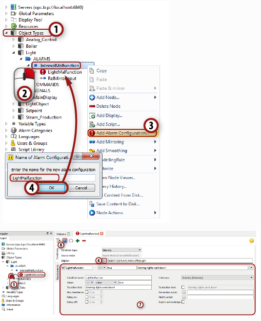

.. hint:: 
  Después de aplicar los cambios a la configuración de la alarma, la misma es heredada por todas las instancias de la alarma.

Mostrando la instancia de la alarma
-----------------------------------
En la sección anterior se logró configurar una alarma, sin embargo; la misma no se puede ver, por lo que en esta sección se configura el display para que muestre la alarma.

Añadiendo un borde al objeto de la alarma
^^^^^^^^^^^^^^^^^^^^^^^^^^^^^^^^^^^^^^^^^

1. Abra el display del objeto, para esto haga doble click en la opción ``Object Types -> Light -> Main Display``.
2. Dibuje un rectángulo alrededor del display del objeto.
3. Seleccione ``None`` en la casilla de ``fill``.
4. Escoja un tamaño apropiado para el dibujo.

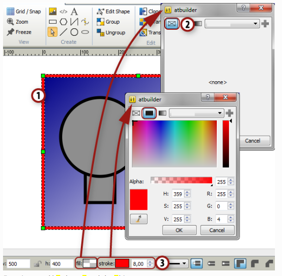

Mostrando los estados de alarma en el display
---------------------------------------------

1. Navegue a ``My Server -> OBJECTS`` en la parte izquierda del constructor de atvise y active la opción de ``InternalMalfunction`` para una de las cinco alarmas.
2. Cargue el display ``Office_Light`` en la ventana de visualización y observe como el estado se muestra. 
3. Desactive la alarma cambiando el valor de la variable de datos a ``false``. 
4. Vuelva a la venta de visualización y haga click en el símbolo de la alarma en el panel de control para desplegar la lista de todas las alarmas registradas con el sistema.
5. De click en la opción de ``ACKNOWLEDGE``.
6. Repita el proceso anterior, activando y desactivando las alarmas. 

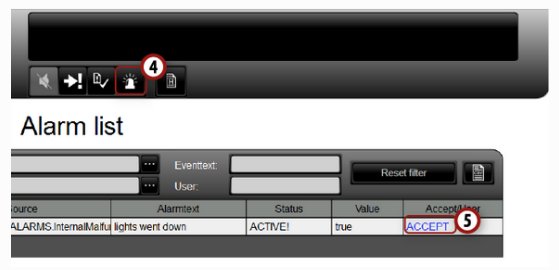

Añadiendo permisos de usuario al proyecto
=========================================

1. Abra la ventana de ``Users & Groups`` dando click al icono de users del lado izquierdo del constructor de atvise.
2. Ahora abra la venta de ``Rights`` y de click en ``Userdefined rights``. 
3. Escoja ``Add right`` del menú que aparece. 
4. En la casilla que aparece, usted puede escribir el nombre que quiera, como ejemplo ``change_light_intensity`` y de click en ``OK``.

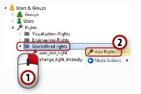

Añadiendo un grupo al proyecto
------------------------------

1. De click derecho en el folder de ``Groups``.
2. Escoja ``Add group`` del menú que aparece.
3. Ponga el nombre de ``Administrators`` en la casilla que aparece.
4. De doble click en el folder de ``Group Editor``.
5. Escriba una descripción, como por ejemplo ``Group of Administrators``.
6. Ponga un Check en la opción de ``USER - Change_light_intensity`` en la casilla de ``Rights List`` en el fondo de la pantalla.

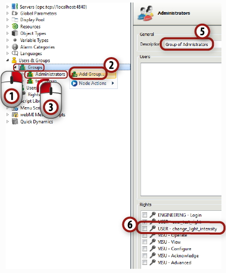

Añadiendo un usuario al grupo
-----------------------------

1. Se puede añadir usuarios directamente a un grupo. Para hacer esto de click derecho en la casilla de ``Administrators``.
2. Escoja ``Add new user`` del menú que aparece.
3. Ponga el nombre al usuario ``admin1``.

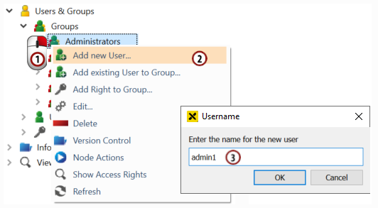

4. Nueva información aparece debajo del folder de ``Administratirs``. De doble click para abrir el editor de usuarios.
5. Escriba un nombre, descripción y lenguaje. 
6. De click en ``Set Password`` y ponga la clave de su elección.
7. Active el ``Project Administrator`` y opciones de ``Visualization`` para el usuario.
8. Guarde la configuración.

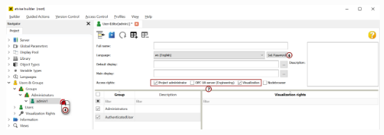

9. Después revise la pestaña de ``Administrators`` y observe el nuevo usuario en la lista de usuarios.